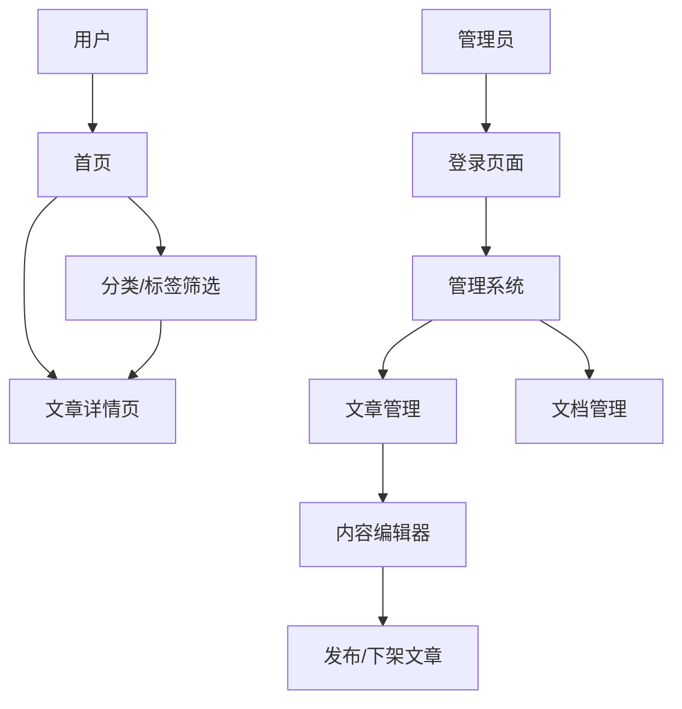
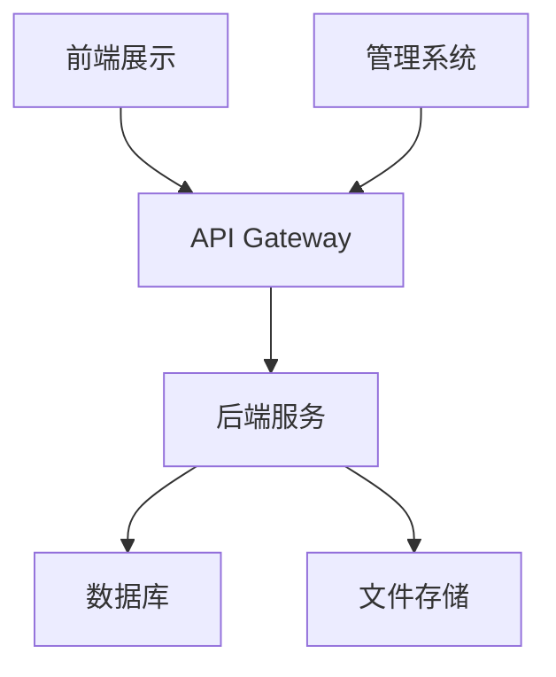

# 个人博客项目 - 产品需求文档

## 1. Product Overview
个人博客前后端分离项目，包含前端内容展示和管理系统，实现文档管理和内容发布功能。
- 解决个人内容创作和管理的需求，为用户提供简洁的博客展示和管理平台
- 目标用户为个人博主，需要一个易用的内容管理系统

## 2. Core Features

### 2.1 User Roles
| 角色 | 注册方式 | 核心权限 |
|------|----------|----------|
| 普通用户 | 无需注册 | 浏览博客内容 |
| 管理员 | 邮箱/密码 | 管理文章、文档，发布/下架内容 |

### 2.2 Feature Module
1. **前端展示**：首页、文章列表、文章详情页
2. **管理系统**：登录页面、文章管理、文档管理、内容编辑

### 2.3 Page Details
| 页面名称 | 模块名称 | 功能描述 |
|----------|----------|----------|
| 首页 | 导航栏 | 网站标题、菜单导航 |
| 首页 | 文章列表 | 展示最新文章，支持分页 |
| 首页 | 分类/标签 | 文章分类和标签筛选 |
| 文章详情页 | 文章内容 | 展示完整文章内容 |
| 文章详情页 | 评论区 | 文章评论功能 |
| 登录页面 | 登录表单 | 管理员登录认证 |
| 管理系统 | 文章管理 | 查看、编辑、发布、下架文章 |
| 管理系统 | 文档管理 | 管理站点文档和页面 |
| 管理系统 | 内容编辑器 | 富文本编辑文章内容 |

## 3. Core Process
**用户浏览流程**：
1. 用户访问首页，浏览文章列表
2. 点击文章进入详情页阅读
3. 可通过分类/标签筛选文章

**管理员操作流程**：
1. 管理员登录管理系统
2. 创建新文章或编辑现有文章
3. 发布或下架文章
4. 管理站点文档

## 4. User Interface Design
### 4.1 Design Style
- 主色调：#333333（深灰）、#666666（中灰）、#FFFFFF（白色）
- 强调色：#0066CC（蓝色）
- 按钮样式：圆角设计，hover效果
- 字体：系统默认无衬线字体，标题18-24px，正文14-16px
- 布局风格：卡片式设计，响应式布局
- 图标风格：线性图标，简洁现代

### 4.2 Page Design Overview
| 页面名称 | 模块名称 | UI元素 |
|----------|----------|--------|
| 首页 | 导航栏 | 固定顶部，响应式菜单，品牌logo |
| 首页 | 文章列表 | 卡片式布局，包含标题、摘要、发布日期、分类标签 |
| 首页 | 分类/标签 | 侧边栏或顶部筛选器，可点击切换 |
| 文章详情页 | 文章内容 | 清晰的排版，适当的行间距，图片居中显示 |
| 文章详情页 | 评论区 | 简洁的评论表单，评论列表按时间排序 |
| 登录页面 | 登录表单 | 居中布局，简洁的表单设计，错误提示 |
| 管理系统 | 文章管理 | 表格形式展示，包含状态、标题、发布日期、操作按钮 |
| 管理系统 | 文档管理 | 树状结构展示，支持拖拽排序 |
| 管理系统 | 内容编辑器 | 富文本编辑器，支持图片上传，实时预览 |

### 4.3 Responsiveness
- 桌面端优先设计，支持响应式布局
- 移动端适配，优化触摸操作
- 断点设置：1200px（桌面）、768px（平板）、480px（手机）

## 5. Technical Architecture
### 5.1 Architecture Design

### 5.2 Technology Description
- 前端：React@18 + Tailwind CSS@3 + Vite
- 后端：Express@4 + Node.js
- 数据库：PostgreSQL
- 认证：JWT
- 文件存储：本地文件系统或云存储

### 5.3 Route Definitions
| 路由 | 用途 |
|------|------|
| / | 首页 |
| /article/:id | 文章详情页 |
| /category/:id | 分类页面 |
| /tag/:id | 标签页面 |
| /admin/login | 管理员登录页 |
| /admin | 管理系统首页 |
| /admin/articles | 文章管理 |
| /admin/documents | 文档管理 |
| /admin/article/create | 创建文章 |
| /admin/article/:id/edit | 编辑文章 |

### 5.4 API Definitions
**认证API**：
- POST /api/auth/login - 管理员登录
- POST /api/auth/logout - 管理员登出

**文章API**：
- GET /api/articles - 获取文章列表
- GET /api/articles/:id - 获取文章详情
- POST /api/articles - 创建文章
- PUT /api/articles/:id - 更新文章
- DELETE /api/articles/:id - 删除文章
- PUT /api/articles/:id/publish - 发布/下架文章

**文档API**：
- GET /api/documents - 获取文档列表
- GET /api/documents/:id - 获取文档详情
- POST /api/documents - 创建文档
- PUT /api/documents/:id - 更新文档
- DELETE /api/documents/:id - 删除文档

### 5.5 Data Model
**用户表（users）**：
- id: SERIAL PRIMARY KEY
- email: VARCHAR(255) UNIQUE NOT NULL
- password_hash: VARCHAR(255) NOT NULL
- role: VARCHAR(50) NOT NULL DEFAULT 'admin'
- created_at: TIMESTAMP DEFAULT NOW()

**文章表（articles）**：
- id: SERIAL PRIMARY KEY
- title: VARCHAR(255) NOT NULL
- content: TEXT NOT NULL
- summary: VARCHAR(500)
- category_id: INTEGER REFERENCES categories(id)
- status: VARCHAR(50) DEFAULT 'draft' -- draft, published
- view_count: INTEGER DEFAULT 0
- created_at: TIMESTAMP DEFAULT NOW()
- updated_at: TIMESTAMP DEFAULT NOW()

**分类表（categories）**：
- id: SERIAL PRIMARY KEY
- name: VARCHAR(100) NOT NULL
- slug: VARCHAR(100) UNIQUE NOT NULL

**标签表（tags）**：
- id: SERIAL PRIMARY KEY
- name: VARCHAR(50) NOT NULL
- slug: VARCHAR(50) UNIQUE NOT NULL

**文章标签关联表（article_tags）**：
- article_id: INTEGER REFERENCES articles(id)
- tag_id: INTEGER REFERENCES tags(id)
- PRIMARY KEY (article_id, tag_id)

**文档表（documents）**：
- id: SERIAL PRIMARY KEY
- title: VARCHAR(255) NOT NULL
- content: TEXT NOT NULL
- path: VARCHAR(255) UNIQUE NOT NULL
- status: VARCHAR(50) DEFAULT 'published' -- draft, published
- created_at: TIMESTAMP DEFAULT NOW()
- updated_at: TIMESTAMP DEFAULT NOW()

**评论表（comments）**：
- id: SERIAL PRIMARY KEY
- article_id: INTEGER REFERENCES articles(id)
- content: TEXT NOT NULL
- author: VARCHAR(100) NOT NULL
- email: VARCHAR(255)
- created_at: TIMESTAMP DEFAULT NOW()

## 6. Acceptance Criteria

### AC-1: 首页展示
- **Given**: 用户访问网站首页
- **When**: 页面加载完成
- **Then**: 显示最新文章列表，包含标题、摘要、发布日期、分类标签
- **Verification**: `human-judgment`

### AC-2: 文章详情页
- **Given**: 用户点击文章标题
- **When**: 进入文章详情页
- **Then**: 显示完整文章内容，包含评论区
- **Verification**: `human-judgment`

### AC-3: 管理员登录
- **Given**: 管理员访问登录页面
- **When**: 输入正确的邮箱和密码
- **Then**: 成功登录并进入管理系统
- **Verification**: `programmatic`

### AC-4: 文章管理
- **Given**: 管理员在管理系统中
- **When**: 点击文章管理
- **Then**: 显示所有文章列表，可进行编辑、发布、下架操作
- **Verification**: `human-judgment`

### AC-5: 内容编辑
- **Given**: 管理员创建或编辑文章
- **When**: 使用富文本编辑器
- **Then**: 可编辑文章内容，支持图片上传，实时预览
- **Verification**: `human-judgment`

### AC-6: 文档管理
- **Given**: 管理员在管理系统中
- **When**: 点击文档管理
- **Then**: 显示文档列表，可进行创建、编辑、删除操作
- **Verification**: `human-judgment`

### AC-7: 发布/下架功能
- **Given**: 管理员在文章管理中
- **When**: 点击发布/下架按钮
- **Then**: 文章状态切换，前端显示/隐藏该文章
- **Verification**: `programmatic`

## 7. Open Questions
- [ ] 是否需要支持Markdown编辑？
- [ ] 文件存储是使用本地还是云存储？
- [ ] 是否需要添加评论审核功能？
- [ ] 是否需要添加SEO优化功能？